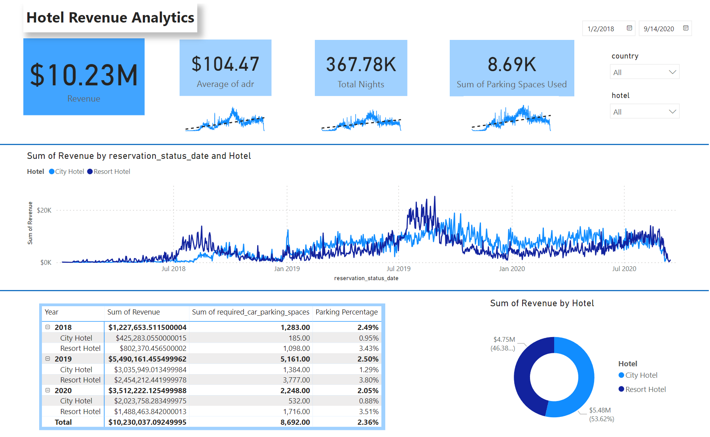

# Hotel Revenue Analysis

Revenue management is more crucial than ever to run a successful and profitable hotel. With all the information that's now readily accessible and there are different ways to track and analyze it, your business has a wealth of new opportunities. Successful hoteliers continuously learn and improve their methods to stay one step ahead of their competition. Revenue management strategies are used by only a small percentage of independent hoteliers, limiting their revenue-generating potential.

## Questions to answer with our dashboard
1. Is our hotel revenue growing yearly?
2. Should we increase our parking lot size?
3. What trends can we see in the data?

## About the Dataset
The dataset used in this analysis is sourced from Kaggle. It consists of hotel booking, and room rate cost data from 2018, 2019, and 2020, along with additional tables containing market segment information and meal costs.

This dataset was chosen purely for learning purposes.
https://www.kaggle.com/datasets/govindkrishnadas/hotel-revenue/data

